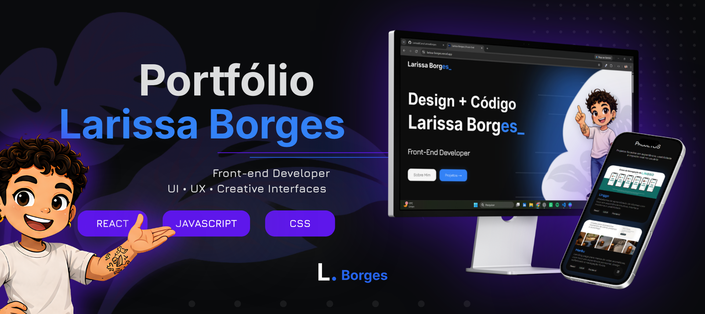

  

<h1 align="center">Larissa Borges — Portfolio</h1>

  Front-end Developer focused on design, code and creative interfaces.

  <a href="https://larissa-borges.vercel.app/">🌐 Live Portfolio</a>
  ·
  <a href="#-português">🇧🇷 Português</a>
  ·
  <a href="#-english">🇺🇸 English</a>

---

## 📊 Project Overview

|                |                    |
| :------------- | :----------------- |
| **Status**     | 🚀 Active          |
| **Type**       | Personal Portfolio |
| **Framework**  | React              |
| **Build Tool** | Vite               |
| **Language**   | JavaScript         |
| **Styling**    | CSS3               |
| **Deployment** | Vercel             |

---

# 🇧🇷 Português

## 📖 Sobre o projeto

Este é o meu **portfólio pessoal como Front-end Developer**.

O projeto foi desenvolvido para apresentar minha trajetória, habilidades e projetos práticos na área de tecnologia, com foco na combinação entre **design, criatividade e desenvolvimento de interfaces**.

A construção do portfólio também representa minha evolução como desenvolvedora e minha transição para a área de tecnologia.

---

## 🎯 Objetivo

Criar uma experiência digital que apresentasse meu trabalho de forma visual, moderna e autêntica.

Mais do que listar tecnologias, o projeto foi pensado para refletir minha forma de trabalhar: **transformando ideias em interfaces criativas e experiências digitais**.

---

## ✨ Funcionalidades

- Interface responsiva
- Apresentação pessoal e profissional
- Seção de projetos
- Timeline de experiência e trajetória
- Stack de tecnologias
- Menu flutuante de navegação
- Formulário de contato
- Animações e interações visuais
- Layout adaptável para diferentes dispositivos

---

## 🛠️ Tecnologias

- React
- Vite
- JavaScript
- CSS3
- HTML5
- EmailJS

---

## 📷 Preview

  

---

## 🌐 Acesse o projeto

🔗 https://larissa-borges.vercel.app/

---

## 💡 Aprendizados

Durante o desenvolvimento deste projeto, pratiquei e aprimorei conhecimentos em:

- Desenvolvimento de interfaces com React
- Componentização
- Organização de aplicações Front-end
- Responsividade
- CSS e criação de interfaces visuais
- Animações e interações
- Integração com serviços externos
- Deploy de aplicações com Vercel

---

## 🔮 Melhorias futuras

- Adicionar novos projetos ao portfólio
- Melhorar continuamente a acessibilidade
- Aprimorar as animações e microinterações
- Otimizar a performance da aplicação
- Evoluir a experiência em dispositivos móveis

---

# 🇺🇸 English

## 📖 About the project

This is my **personal portfolio as a Front-end Developer**.

The project was created to showcase my journey, skills and practical projects in technology, focusing on the combination of **design, creativity and interface development**.

The portfolio also represents my growth as a developer and my transition into the technology field.

---

## 🎯 Goal

To create a digital experience that presents my work in a visual, modern and authentic way.

Rather than simply listing technologies, the project was designed to reflect the way I work: **turning ideas into creative interfaces and digital experiences**.

---

## ✨ Features

- Responsive interface
- Personal and professional presentation
- Projects section
- Experience and career timeline
- Technology stack
- Floating navigation menu
- Contact form
- Visual animations and interactions
- Adaptive layout for different devices

---

## 🛠️ Technologies

- React
- Vite
- JavaScript
- CSS3
- HTML5
- EmailJS

---

## 🌐 Live Portfolio

🔗 https://larissa-borges.vercel.app/

---

## 💡 What I learned

Throughout this project, I practiced and improved my knowledge of:

- React interface development
- Componentization
- Front-end application organization
- Responsive design
- CSS and visual interface development
- Animations and interactions
- External service integration
- Application deployment with Vercel

---

## 🔮 Future improvements

- Add new projects to the portfolio
- Continuously improve accessibility
- Enhance animations and microinteractions
- Optimize application performance
- Improve the mobile experience

---

## 👩‍💻 About me

I'm **Larissa Borges**, a Systems Analysis and Development student and Front-end Developer focused on creating modern, creative and user-centered interfaces.

I enjoy combining **design and code** to transform ideas into digital experiences.

---

  <i>Design + Code + Creative Interfaces</i>

